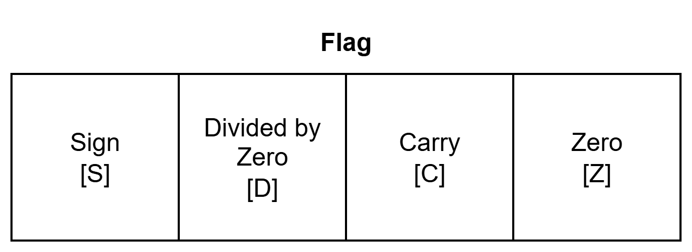
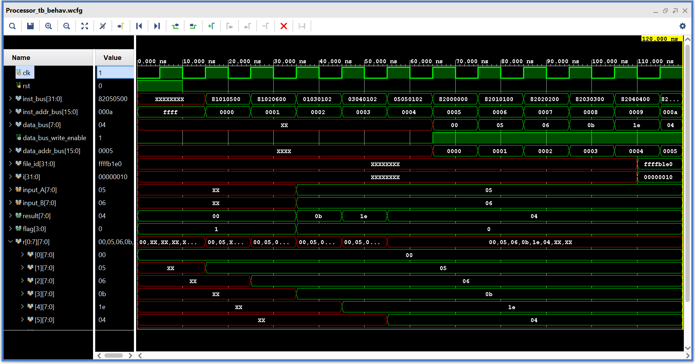
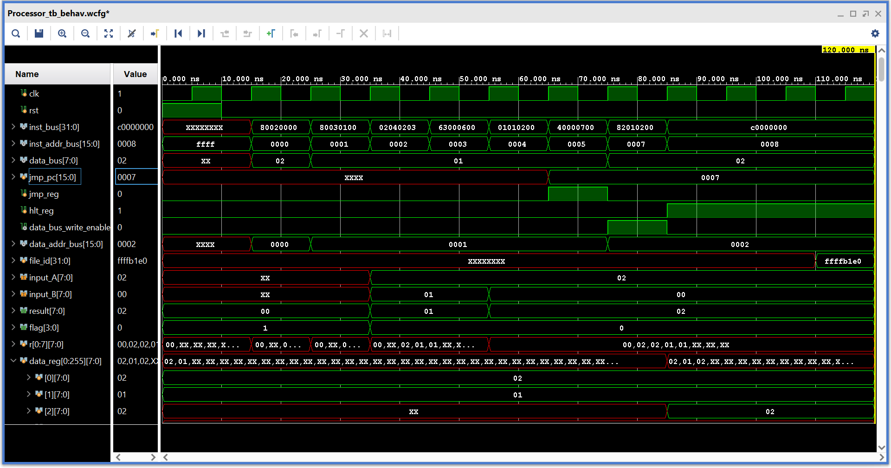

# Self Designed RISC Style 8-Bit Processor

A simple and minimal RISC style 8-bit processor using verilog and AMD Vivado.


## Design

### Generic Block Diagram


### Top Level Netlist Schematic


## Design Modules

### Arithmetic Logic Unit (ALU)


ALU receives two 8-bit inputs named as A and B, performs arithmetic and logic operations based on 4-bit ALU control and provides 8-bit result. It also affects 4-bit flag based on operation. The operations performed by ALU are as follows:

| ALU Control | Operation    | Result      |
|-------------|--------------|-------------|
| 0H          | No operation | Don't care  |
| 1H          | Add          | A + B       |
| 2H          | Subtract     | A - B       |
| 3H          | Multiply     | A * B       |
| 4H          | Divide       | A / B       |
| 5H          | AND          | A & B       |
| 6H          | OR           | A \| B      |
| 7H          | XOR          | A ^ B       |
| 8H          | Shift Left   | A << B      |
| 9H          | Shift Right  | A >> B      |
| FH          | Reset flag   | 0           |

The flag register is affected by every ALU operation except NOP. The structure of flag register is shown below:



- **Sign Flag [S]**: It is set when MSB of result is 1 repressing as negative signed value.
- **Carry Flag [C]**: It is set if there is carry during addition or borrow during substraction.
- **Devided by Zero Flag [D]**: It is set if divider is zero.
- **Zero**: It is set if result is zero.

### Register File
Register file contains eight registers (R0-R7) of 8-bit. Two registers can be read and one register can be written at the same time. The value of register R0 is always zero which help in move operation via ALU.

### Control Unit (CU)
Control unit controls the signals such as ALU control, address buses, reset, write enable and so on. In one cycle, it reads instruction from external instruction memory, generate control signals and executes the operation. It consists program counter (PC) whic is incremented every cycle with exclusion of jump operation and halt.


## Instruction Set


One instruction size is four bytes containing 8-bit opcode and three 8-bit operands. CU performs operation according to opcode. In this processor, there are three types of operation which are as follows:

### Operation Types
| Opcode    | Operation Type              |
|-----------|-----------------------------|
| 10XX_XXXX | Load and store register     |
| 01XX_XXXX | Jump                        |
| 00XX_XXXX | Data processing (use of ALU)|

In data processing, the four LSB bits are assigned to ALU control.

### Instruction Table
| Opcode          | Operation                    | Operand 0                    | Operand1                  | Operand2                   |
|-----------------|-----------------------|------------------------------|---------------------------|----------------------------|
| 1000_0000 (80H) | Load direct           | Destination register address | Lower data memory address | Higher data memory address |
| 1000_0001 (81H) | Load immediate        | Destination register address | Immediate value           | Don't care                 |
| 1000_0010 (82H) | Store direct          | Source register address      | Lower data memory address | Higher data memory address |
| 1000_0011 (83H) | Store immediate       | Source register address      | Immediate value           | Don't care                 |
| 0100_0000 (40H) | Uncondtinal jump      | Don't care                   | Lower instruction address | Higher instruction address |
| 0110_0001 (61H) | Jump on zero (Z flag) | Don't care                   | Lower instruction address | Higher instruction address |
| 0110_0010 (62H) | Jump on divided by zero (D flag)  | Don't care       | Lower instruction address | Higher instruction address |
| 0110_0011 (63H) | Jump on carry (C flag)            | Don't care       | Lower instruction address | Higher instruction address |
| 0110_0100 (64H) | Jump on negative (S flag)         | Don't care       | Lower instruction address | Higher instruction address |
| 0111_0001 (71H) | Jump on not zero (!Z)             | Don't care       | Lower instruction address | Higher instruction address |
| 0111_0010 (72H) | Jump on not divided by zero (!D)  | Don't care       | Lower instruction address | Higher instruction address |
| 0111_0011 (73H) | Jump on not carrry (!C)           | Don't care       | Lower instruction address | Higher instruction address |
| 0111_0100 (74H) | Jump on not negative (!S)         | Don't care       | Lower instruction address | Higher instruction address |
| 0000_0000 (00H) | No operation          | Don't care                   | Don't care                | Don't care                 |
| 0000_0001 (01H) | Add                   | Destination register address | Source 1 register address | Source 2 register address  |
| 0000_0010 (02H) | Subtract              | Destination register address | Source 1 register address | Source 2 register address  |
| 0000_0011 (03H) | Multiply              | Destination register address | Source 1 register address | Source 2 register address  |
| 0000_0100 (04H) | Divide                | Destination register address | Source 1 register address | Source 2 register address  |
| 0000_0101 (05H) | AND                   | Destination register address | Source 1 register address | Source 2 register address  |
| 0000_0110 (06H) | OR                    | Destination register address | Source 1 register address | Source 2 register address  |
| 0000_0111 (07H) | XOR                   | Destination register address | Source 1 register address | Source 2 register address  |
| 0000_1000 (08H) | Shift Left            | Destination register address | Source 1 register address | Source 2 register address  |
| 0000_1001 (09H) | Shift Right           | Destination register address | Source 1 register address | Source 2 register address  |
| 0000_1111 (0FH) | Reset flag (0001)     | Don't care                   | Don't care                | Don't care                 |
| 1100_0000 (C0H) | Halt                  | Don't care                   | Don't care                | Don't care                 |

### Jump Instruction Types
| Opcode    | Jump Type                          |
|-----------|------------------------------------|
| 0100_XXXX | Unconditional jump                 |
| 0110_XXXX | Condtional jump on flag bit set    |
| 0111_XXXX | Conditional jump on flag bit reset |


## Simulation

### Simulation Modules
- **Instruction Memory**: A simple read only memory having 32-bit width to store instructions. The instructions are loaded from ``instruction_memory.mem`` memory file.

- **Data Memory**: A simple read and write memory having 8-bit width to store and read data. The initial data are loaded from ``data_memory.mem`` memory file. At the end of simulation, the data memory is written to a file whose path is defined in header file ``parameter.vh``.

### Simulation Testbench Modules
- **ALU Testbench**
- **Instruction Memory Testbench**
- **Data Memory Testbench**
- **Processor Testbench**

### ALU Testbench Simulation
``Fig: ALU Testbench Simulation Waveform``:


### Instruction Memory Testbench Simulation
``instruction_memory.mem``:
```txt
81_01_05_00 // R1 <- 05
81_02_06_00 // R2 <- 06
01_03_01_02 // R3 <- R1 + R2
03_04_01_02 // R4 <- R1 * R2
05_05_01_02 // R5 <- R1 & R2
82_00_00_00 // M[0000] <- R0
82_01_01_00 // M[0001] <- R1
82_02_02_00 // M[0002] <- R2
82_03_03_00 // M[0003] <- R3
82_04_04_00 // M[0004] <- R4
82_05_05_00 // M[0005] <- R5
```

``Fig: Instruction Memory Testbench Simulation Waveform``:


### Data Memory Testbench Simulation
``data_memory.mem``:
```txt
01
02
03
04
05
06
07
08
09
00
```

``Fig: Data Memory Testbench Simulation Waveform``:


``data_memory_dumped.txt``:
```
mem[0] = aa
mem[1] = bb
mem[2] = cc
mem[3] = 04
mem[4] = 05
mem[5] = 06
mem[6] = 07
mem[7] = 08
mem[8] = 09
mem[9] = 00
mem[10] = xx
mem[11] = xx
mem[12] = xx
mem[13] = xx
mem[14] = xx
mem[15] = xx
```

### Processor Testbench Simulation

**Load, Store and Data Processing Test**:

``instruction_memory.mem`` and ``data_memory.mem`` are same as previous.

``Fig: Processor Testbench Simulation Waveform``:


``data_memory_dumped.txt``:
```txt
mem[0] = 00
mem[1] = 05
mem[2] = 06
mem[3] = 0b
mem[4] = 05
mem[5] = 06
mem[6] = 07
mem[7] = 08
mem[8] = 09
mem[9] = 00
mem[a] = xx
mem[b] = xx
mem[c] = xx
mem[d] = xx
mem[e] = xx
mem[f] = xx
```

**Jump Instruction Test**:

``instruction_memory.mem``:
```txt
// To find the maximum of two number from data memory at address 0000H and 00001H and store the max value into data memory at address 0002H.
80_02_00_00 // 00: R2 <- M[0000H]; load from data memory
80_03_01_00 // 01: R3 <- M[0001H]; load from data memory
02_04_02_03 // 02: R4 <- R2 - R3; if there is carry, R3 is greater than R2 else R2 is greater than or equal to R3
63_00_06_00 // 03: PC <- 0006H; if carry
01_01_02_00 // 04: R1 <- R2 + R0; no carry, so R2 is greater and move to R1 (R0 is always 0)
40_00_07_00 // 05: PC <- 0007H; jump to store into data memory
01_01_03_00 // 06: R1 <- R3 + R0; carry, so R3 is greater and move to R1
82_01_02_00 // 07: M[0002H] <- R1; store maximum value into data memory
C0_00_00_00 // 08: PC <- PC; Halt
```

``data_memory.mem``:
```txt
02
01
```

``Fig: Processor Testbench Simulation Waveform for Jump``:


``data_memory_dumped.txt``:
```txt
mem[0] = 02
mem[1] = 01
mem[2] = 02
mem[3] = xx
mem[4] = xx
mem[5] = xx
mem[6] = xx
mem[7] = xx
mem[8] = xx
mem[9] = xx
mem[a] = xx
mem[b] = xx
mem[c] = xx
mem[d] = xx
mem[e] = xx
mem[f] = xx
```